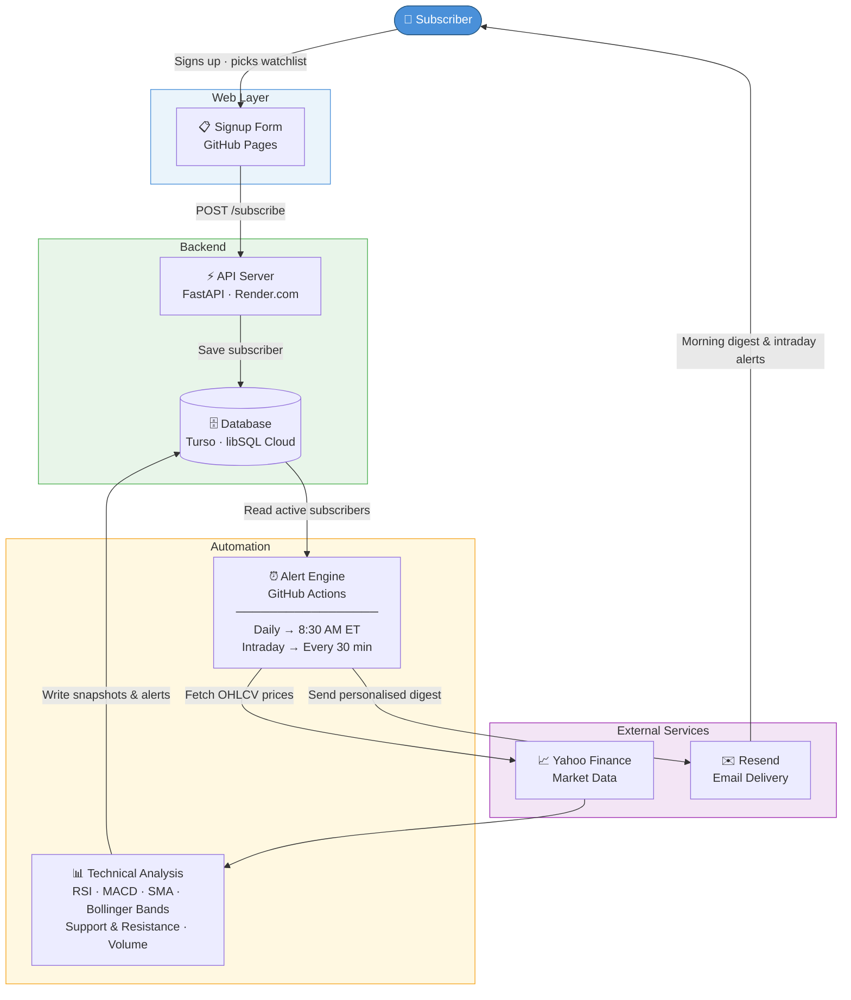

# Stock Alert System

> Personalized US stock and ETF alerts — delivered to your inbox, automatically.

Subscribers pick their watchlist once. Every morning before market open, the system analyses every stock, detects trading signals, and delivers a personalised digest ranked by confidence. High-confidence intraday signals are sent in real time throughout the trading day.

Zero infrastructure cost — runs entirely on free tiers.

---

## Architecture



---

## How It Works

| Step | What happens |
|------|-------------|
| 1 | Subscriber fills out the signup form on GitHub Pages — picks stock symbols and a schedule |
| 2 | Form posts to the FastAPI backend on Render.com, which saves the user to Turso |
| 3 | GitHub Actions runs daily at 8:30 AM ET (Mon–Fri) and intraday every 30 min during market hours |
| 4 | Each run fetches OHLCV data from Yahoo Finance — each symbol fetched once, shared across all users |
| 5 | Pure pandas computes RSI, MACD, SMA 20/50/200, Bollinger Bands, Support/Resistance |
| 6 | Signals are ranked by confidence score and a personalized digest is built per subscriber |
| 7 | Resend delivers the email — morning digest (top 3 ETFs + top 3 stocks) or intraday alert (confidence ≥ 8) |

---

## Stack

| Layer | Technology |
|-------|-----------|
| Signup form | GitHub Pages (vanilla JS, no framework) |
| API backend | FastAPI on Render.com (free tier, Singapore) |
| Database | Turso — libSQL cloud via HTTP API (no native driver) |
| Data source | Yahoo Finance via `yfinance` (free, no API key) |
| Analysis | Pure pandas/numpy — RSI, MACD, Bollinger Bands, SMA |
| Email | Resend (3,000 emails/month free) |
| Scheduling | GitHub Actions — cron on Ubuntu runners |

---

## Signals Detected

- `RSI_OVERBOUGHT` / `RSI_OVERSOLD`
- `RSI_PRE_OVERBOUGHT` / `RSI_PRE_OVERSOLD`
- `MACD_BULLISH_CROSS` / `MACD_BEARISH_CROSS`
- `VOLUME_SPIKE` / `VOLUME_ELEVATED`
- `NEAR_RESISTANCE` / `NEAR_SUPPORT`
- `BB_ABOVE_UPPER` / `BB_BELOW_LOWER`
- `BULLISH_CONFLUENCE` / `BEARISH_CONFLUENCE`

---

## Project Structure

```
stock-alert-system/
├── src/
│   ├── api/           # FastAPI backend (Render.com)
│   ├── ingestion/     # Yahoo Finance data fetcher
│   ├── analysis/      # Technical indicators (pure pandas)
│   ├── alerts/        # Signal engine + digest builder
│   ├── notifications/ # Resend email sender
│   ├── storage/       # Turso HTTP API client + CRUD
│   └── main.py        # CLI entrypoint for GitHub Actions
├── templates/         # MJML email templates
├── config/            # watchlist.yml, settings.yml
├── docs/              # GitHub Pages signup form + PlantUML diagram
├── .github/workflows/ # daily_analysis.yml, intraday_check.yml
├── render.yaml        # Render.com deployment config
├── requirements.txt        # GitHub Actions deps (full)
└── requirements-api.txt    # Render.com deps (lightweight)
```

---

## Setup

### 1. Clone and configure

```bash
git clone https://github.com/theknightcodes/stock-alert-system.git
cd stock-alert-system
cp .env.example .env
# Fill in your values in .env
```

### 2. Required environment variables

| Variable | Where to set | Description |
|----------|-------------|-------------|
| `DATABASE_URL` | GitHub Secret + Render | Turso URL — `libsql+https://...?authToken=...` |
| `RESEND_API_KEY` | GitHub Secret + Render | Resend API key |
| `EMAIL_RECIPIENTS` | GitHub Secret | Fallback email (comma-separated) |
| `API_SECRET_KEY` | Render | Random secret for internal API calls |
| `ALLOWED_ORIGIN` | Render (render.yaml) | GitHub Pages URL for CORS |

### 3. Deploy API to Render

- Connect your GitHub repo on [render.com](https://render.com)
- Build command: `pip install -r requirements-api.txt`
- Start command: `uvicorn src.api.main:app --host 0.0.0.0 --port $PORT`
- Add the environment variables above

### 4. Enable GitHub Pages

- Repo → Settings → Pages → Source: `main` branch → `/docs` folder
- Signup form will be live at `https://theknightcodes.github.io/stock-alert-system/`

### 5. Add GitHub Secrets

Repo → Settings → Secrets and variables → Actions:
- `DATABASE_URL`
- `RESEND_API_KEY`
- `EMAIL_RECIPIENTS`

---

## Running Locally

```bash
pip install -r requirements.txt
python -m src.main daily --all-users
```

---

## Schedules

| Workflow | Schedule | Purpose |
|----------|----------|---------|
| `daily_analysis.yml` | Mon–Fri 8:30 AM ET | Full morning digest per subscriber |
| `intraday_check.yml` | Every 30 min, 9:30 AM–4 PM ET | High-confidence intraday alerts |

Both workflows can be triggered manually from the GitHub Actions tab.
